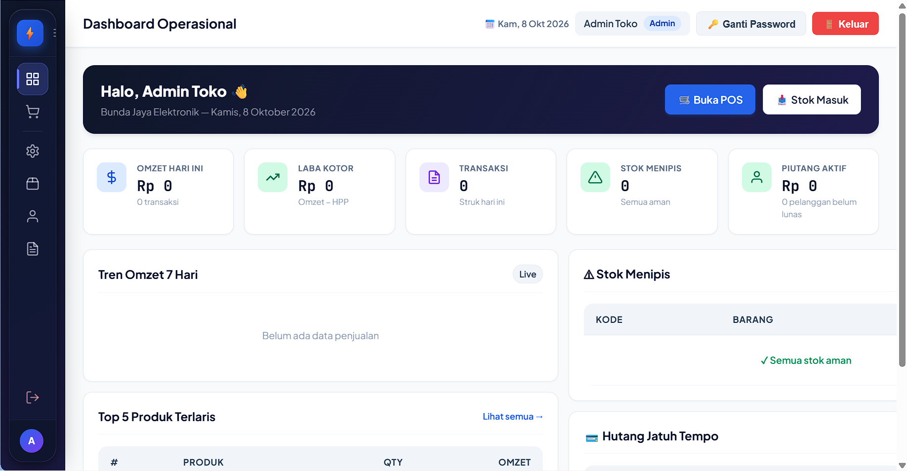
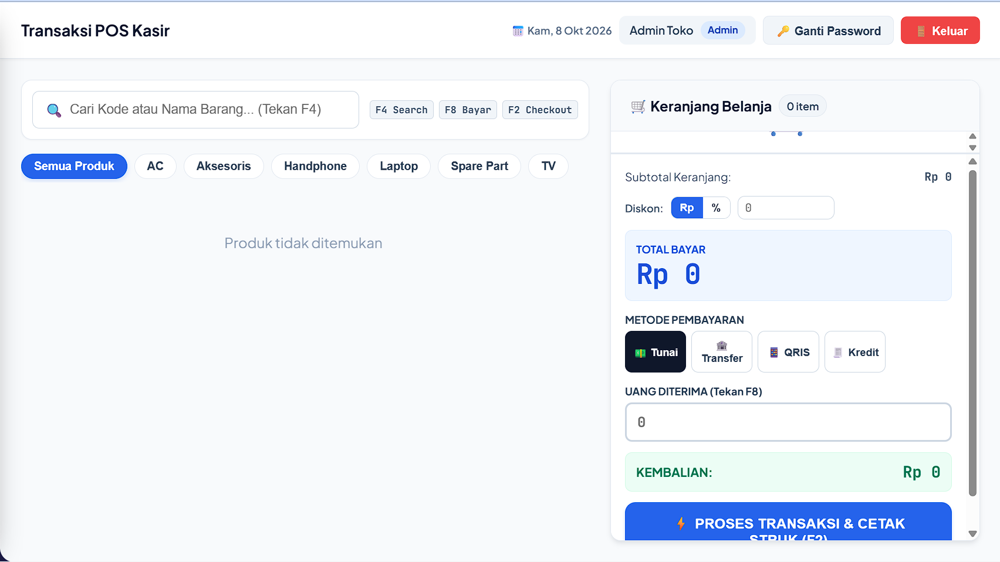

# 🏪 Bunda Jaya Elektronik

### Sistem Informasi Toko Elektronik — POS, Inventaris & Pembukuan


Aplikasi web untuk mengelola **toko elektronik**: kasir (POS), stok barang, pembelian ke supplier, hutang & piutang, sampai laporan keuangan. Dibangun untuk operasional harian yang cepat dan anti ribet.

---

## ✨ Fitur Utama

### 🛒 Kasir / Point of Sale
- Transaksi tunai, transfer, QRIS, dan **kredit fleksibel** (DP + cicilan bebas)
- Diskon persen / nominal, hitung kembalian otomatis
- Cetak struk thermal

### 📦 Inventaris
- Master barang, kategori, dan merek (CRUD lengkap)
- Stok masuk (pembelian) & stok keluar otomatis per transaksi
- Peringatan stok menipis

### 🚚 Pembelian & Hutang Supplier
- Catat pembelian tunai / hutang dengan jatuh tempo
- Riwayat pembayaran hutang bertahap

### 💳 Piutang Pelanggan
- Penjualan kredit dengan uang muka & cicilan fleksibel
- Pantau sisa piutang per pelanggan

### 📊 Laporan (Owner)
- Penjualan harian, barang terlaris, arus kas, stok menipis
- Filter tanggal & sortir

### 🔐 Keamanan
- Login + session aman (HttpOnly, SameSite, regenerasi session)
- Proteksi CSRF & XSS, rate-limit anti brute-force
- Role: **Owner** & **Admin** (dengan manajemen pengguna)

---

## 🖼️ Preview

> Ganti file di bawah dengan screenshot asli aplikasimu.

| Dashboard | Kasir POS |
|-----------|-----------|
|  |  |

---

## 🚀 Cara Instalasi

### Syarat
- PHP 8.x + ekstensi `pdo_mysql`
- MySQL 8.x / MariaDB
- Node.js 18+ (untuk development frontend)

### 1. Clone repository
```bash
git clone https://github.com/Pdrsmth/bunda-jaya-elektronik.git
cd bunda-jaya-elektronik
```

### 2. Setup database
```sql
-- Buat database, lalu import schema:
SOURCE database/schema.sql;
-- (Opsional) data contoh:
SOURCE database/seed-data-real.sql;
```

### 3. Konfigurasi koneksi database
Edit `api/config/database.php`:
```php
private $host = 'localhost';
private $db_name = 'toko_elektronik';
private $username = 'root';
private $password = '';
```

### 4. Jalankan development server
```bash
npm install
npm run dev
# buka http://localhost:3000
```

> Folder project harus berada di document root web server (mis. `C:\laragon\www\Bunda Jaya Elektronik`) agar `/api` terjangkau frontend.

### 5. Login awal
| Username | Password   | Role  |
|----------|------------|-------|
| owner    | password123 | Owner |
| admin    | password123 | Admin |

> ⚠️ **Segera ganti password** setelah login pertama via tombol 🔑 di navbar.

### Build production
```bash
npm run build   # hasil di folder dist/
```

---

## 📁 Struktur Folder

```
bunda-jaya-elektronik/
├── api/                    # Backend PHP (REST API)
│   ├── auth.php            # Login, logout, ganti password
│   ├── barang.php          # Master barang
│   ├── transaksi.php       # Penjualan / POS
│   ├── pembelian.php       # Stok masuk
│   ├── hutang.php          # Hutang supplier
│   ├── piutang.php         # Piutang pelanggan
│   ├── dashboard.php       # Data laporan
│   ├── users.php           # Manajemen pengguna (Owner)
│   ├── kategori.php        # Kategori & merek
│   └── config/ utils/      # DB, CORS, session, CSRF, validator
├── src/                    # Frontend (Vite + vanilla JS)
│   ├── js/
│   │   ├── views/          # Halaman (pos, barang, laporan, ...)
│   │   ├── components/     # Navbar, sidebar, struk, toast
│   │   ├── api/            # API client
│   │   └── utils/          # Helper (esc, formatRupiah, ...)
│   └── css/                # Stylesheet
├── database/               # Schema, migrasi, seed
│   ├── schema.sql
│   ├── migrasi-*.sql
│   └── seed-data-real.sql
├── index.html              # Entry point
└── vite.config.js
```

**Kenapa struktur ini?** Backend dan frontend dipisah tegas (`api/` vs `src/`) supaya bisa di-deploy terpisah kalau perlu, migrasi database berversi (`migrasi-*.sql`) supaya upgrade database lama aman tanpa hapus data, dan semua validasi penting ada di server (frontend tidak dipercaya).

---

## 🛠️ Teknologi

- **Backend**: PHP 8 (REST API, PDO prepared statements)
- **Database**: MySQL 8 (InnoDB, transaksi ACID)
- **Frontend**: JavaScript ES modules + Vite
- **Auth**: Session + CSRF token + bcrypt + rate limiting

---

## 🤝 Kontribusi

Lihat [CONTRIBUTING.md](CONTRIBUTING.md) untuk panduan kontribusi.

## 📄 Lisensi

Proyek ini berlisensi [MIT](LICENSE).
